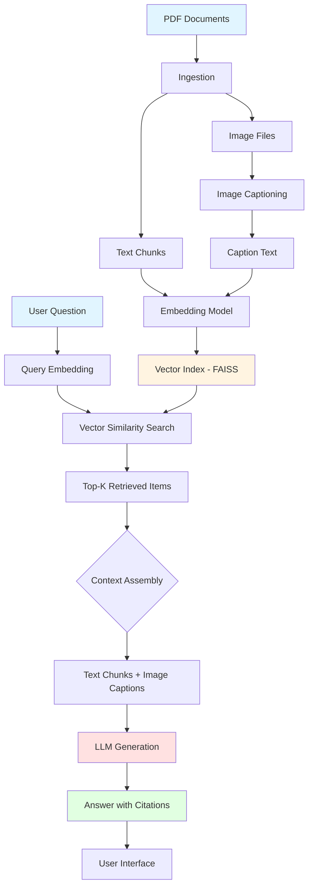

# Multi-Modal RAG for Technical Datasheets

A retrieval-augmented generation system that answers questions about technical documentation by combining text extraction with visual understanding. The system extracts information from both textual content and embedded diagrams, charts, and schematics, providing answers with precise page-level citations.

## Overview

This project implements a practical approach to document question-answering that respects the multi-modal nature of technical PDFs. Rather than treating documents as pure text, it processes both the written specifications and visual elements, generating natural language captions for images and indexing them alongside textual content.

When you ask a question, the system retrieves the most relevant passages and image descriptions, synthesizes them into a coherent answer, and cites its sources with document and page references.

## Quick Start

**1. Set up your environment**

```bash
python -m venv .venv
source .venv/bin/activate
pip install -U pip
pip install -r requirements.txt
```

**2. Process your documents**

The build pipeline extracts text and images, generates captions, and creates a searchable vector index:

```bash
python -m scripts.build_all
```

This processes PDFs from the `data/` directory and writes artifacts to `artifacts/`. On first run, it will download the required models (approximately 500MB total).

**3. Launch the interface**

```bash
streamlit run streamlit_app.py
```

Open your browser to `http://localhost:8501` and start asking questions.

**Optional:** Set the `OPENAI_API_KEY` environment variable to use GPT-4o-mini for answer generation. Without it, the system falls back to a local heuristic that selects relevant sentences from retrieved context.

## Architecture

```
┌─────────────────────────────────────────────────────────────────┐
│                         Data Sources                             │
│                    Technical PDF Documents                       │
└────────────────────┬────────────────────────────────────────────┘
                     │
                     ▼
┌─────────────────────────────────────────────────────────────────┐
│                    Ingestion Pipeline                            │
│  ┌──────────────────┐              ┌──────────────────┐        │
│  │  Text Extractor  │              │ Image Extractor  │        │
│  │    (PyMuPDF)     │              │    (PyMuPDF)     │        │
│  └────────┬─────────┘              └────────┬─────────┘        │
│           │                                 │                   │
│           ▼                                 ▼                   │
│  ┌──────────────────┐              ┌──────────────────┐        │
│  │  chunks.jsonl    │              │  images.jsonl    │        │
│  │  (page-level)    │              │  + image files   │        │
│  └────────┬─────────┘              └────────┬─────────┘        │
└───────────┼────────────────────────────────┼──────────────────┘
            │                                │
            │                                ▼
            │                     ┌──────────────────────┐
            │                     │ Captioning Pipeline  │
            │                     │    (BLIP Model)      │
            │                     └──────────┬───────────┘
            │                                │
            │                                ▼
            │                     ┌──────────────────────┐
            │                     │  captions.jsonl      │
            │                     └──────────┬───────────┘
            │                                │
            └────────────┬───────────────────┘
                         ▼
            ┌────────────────────────────┐
            │    Embedding & Indexing    │
            │  (SentenceTransformers)    │
            │      + FAISS Index         │
            └────────────┬───────────────┘
                         │
                         ▼
            ┌────────────────────────────┐
            │    index.faiss             │
            │    index_meta.json         │
            └────────────┬───────────────┘
                         │
        ┌────────────────┴────────────────┐
        │                                 │
        ▼                                 ▼
┌──────────────┐                 ┌──────────────────┐
│  User Query  │                 │  Retrieval       │
│  Interface   │────────────────▶│  (Vector Search) │
│  (Streamlit) │                 └────────┬─────────┘
└──────────────┘                          │
        ▲                                 ▼
        │                      ┌──────────────────────┐
        │                      │ Answer Generation    │
        │                      │ (GPT-4o-mini or      │
        │                      │  Local Fallback)     │
        │                      └──────────┬───────────┘
        │                                 │
        └─────────────────────────────────┘
                 Answer + Citations
```

## How It Works

The system operates in four stages:



### 1. Ingestion
Pages are extracted from PDFs using PyMuPDF. Text is captured at the page level to maintain context, while embedded images are saved individually. Each element is tagged with document ID and page number for citation tracking.

### 2. Captioning
A vision-language model (BLIP) generates natural language descriptions of extracted images. This makes visual information—schematics, diagrams, charts—searchable through text queries. The captions are designed to describe technical content rather than aesthetic qualities.

### 3. Indexing
Both text passages and image captions are embedded using sentence-transformers (all-MiniLM-L6-v2) into a shared semantic space. FAISS indexes these embeddings for efficient similarity search. This unified approach allows questions to retrieve answers from either modality.

### 4. Retrieval & Generation
When you ask a question, it's embedded with the same model and compared against the index. The top-k most similar items are retrieved, formatted with their source tags, and fed as context to the generator. The answer is constrained to only use provided information, with citations included inline.

## Project Structure

```
├── data/                      # Source PDFs (place your documents here)
├── artifacts/                 # Generated pipeline outputs
│   ├── chunks.jsonl          # Extracted text passages
│   ├── images.jsonl          # Image metadata and paths
│   ├── captions.jsonl        # Generated image descriptions
│   ├── index.faiss           # Vector search index
│   ├── index_meta.json       # Index metadata and mappings
│   └── images/               # Extracted image files
├── src/mmrag/                # Core implementation
│   ├── ingest.py            # PDF parsing and extraction
│   ├── caption.py           # Image captioning pipeline
│   ├── index.py             # Vector indexing and search
│   └── rag.py               # Retrieval and answer generation
├── scripts/                  # Pipeline orchestration
│   ├── build_all.py         # End-to-end build script
│   └── qa_cli.py            # Command-line query interface
├── eval/                     # Evaluation framework
│   ├── questions.jsonl      # Test question set
│   └── run_eval.py          # Automated accuracy testing
└── streamlit_app.py          # Web interface
```

## Evaluation

The system includes a built-in evaluation framework with a curated set of questions spanning both text and image-based information:

```bash
python -m eval.run_eval
```

This outputs metrics including:
- Overall accuracy (citation-validated)
- Success rate on image-centric questions
- Average and p95 latency
- Per-question results

To measure the contribution of visual understanding, run a text-only ablation by temporarily removing `artifacts/captions.jsonl` and rebuilding the index.

## Technical Details

**Models:**
- Embeddings: `sentence-transformers/all-MiniLM-L6-v2` (384-dim, normalized for cosine similarity)
- Captioning: `Salesforce/blip-image-captioning-base` (CPU-friendly, ~500MB)
- Generation: OpenAI GPT-4o-mini (optional) or local sentence selection

**Performance:**
- Designed for CPU execution; no GPU required
- Typical query latency: 0.5-2s depending on configuration
- Memory footprint: ~1-2GB for loaded models

**Limitations:**
- Single-step reasoning only (no chain-of-thought or multi-hop)
- Page-level text chunking may split important context
- Image captions are auto-generated and can be imprecise
- Best suited for factual lookup rather than complex synthesis

## CLI Usage

For scripting or integration testing, use the command-line interface:

```bash
python -m scripts.qa_cli "What is the operating temperature range?"
```

## Design Philosophy

This project prioritizes clarity and reproducibility over performance optimization. All dependencies are pinned, models are versioned, and the pipeline is deterministic where possible. The code is structured to be readable and modifiable—each stage can be swapped independently.

The goal is to demonstrate a complete multi-modal RAG system that works reliably on real technical documents without requiring specialized infrastructure.

## License

MIT

## Acknowledgments

Built with PyMuPDF, Transformers, FAISS, Sentence-Transformers, and Streamlit. Test dataset courtesy of the Library of Congress Web Archive.