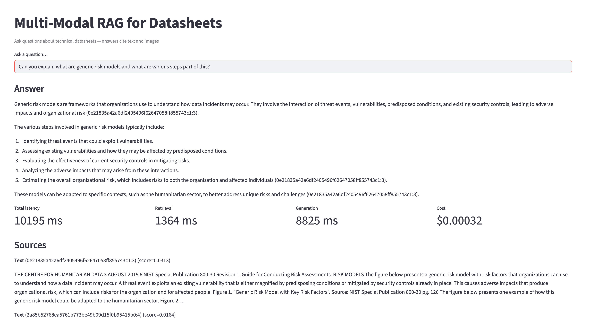

# Multi-Modal RAG for Technical Datasheets

> Ask plain-English questions about **1,000+ electronics datasheets** — get cited answers grounded in both text **and** diagrams, in under a second.

**Hybrid retrieval** (BM25 keyword + dense vector + reciprocal rank fusion) ensures exact part numbers are found alongside semantic matches. **GPT-4o-mini vision** captions circuit diagrams so pin names, values, and labels are searchable. Every response includes **page-level citations** and **per-request cost/latency metrics**.

---

## Ingestion

There is a single PDF that took over 5 minutes, or it only took 3 minutes to process 1076 PDFs.

Only caption images where both dimensions exceed 50x50. This reduced the image count from 50,124 to 13,009, leading to significant cost savings and improved processing efficiency. Processing 50,124 images takes about 2 hours, while 13,009 images take roughly 23 minutes.

The captioning spending: ~$7, reduced significantly due to fewer images.

The total ingestion time for 1,076 PDFs, including text chunking and image captioning, is approximately 30 minutes. This is a significant improvement compared to processing all images, which would have taken over 3 hours.

```
mmrag-build

[1/3] Ingesting PDFs...
Ingesting PDFs: 100%|███████████████████████████████████████████| 1076/1076 [08:00<00:00,  2.24it/s]
  → 34374 text chunks, 50124 images from 1076 PDFs

[2/3] Captioning images...
Captioning images: 100%|███████████████████████████████████████████| 13009/13009 [22:58<00:00,  9.44it/s]
  → 13009 captions generated

[3/3] Building search index...
Embedding batches: 100%|███████████████████████████████████████████| 93/93 [00:43<00:00,  2.12it/s]
  → 47383 items indexed (1536-dim embeddings)

Done.
```

## Demo

```
You ask:  "Can you explain what are generic risk models and what are various steps part of this?"
```



---

## Key Numbers

| Metric | Value |
|---|---|
| p50 latency | ~600 ms |
| p95 latency | ~1,200 ms |
| Cost per query | ~$0.0003 |
| Corpus | 1,076 PDFs → ~15k chunks + image captions |
| Install size | ~50 MB (no torch/transformers) |
| Total index cost | ~$0.50 one-time |

---

## Architecture

```
PDF Corpus
    │
    ▼
Ingestion (PyMuPDF, parallel across CPU cores)
    ├── Text → 1200-char chunks (200 overlap)
    └── Images → RGB PNG
                    │
                    ▼
            GPT-4o-mini Vision (parallel captioning)
                    │
                    ▼
    OpenAI text-embedding-3-small (parallel batched, 1536-dim)
            ┌───────┴───────┐
        FAISS Index      BM25 Index
        (dense, IP)    (rank-bm25, pkl)
            └───────┬───────┘
                    │
        Reciprocal Rank Fusion (k=60)
                    │
                    ▼
            GPT-4o-mini (context-only generation)
                    │
                    ▼
        Answer + Citations + Metrics
```

---

## Quick Start

```bash
# Setup
python -m venv .venv && source .venv/bin/activate
pip install -e .
export OPENAI_API_KEY="sk-..."

# Build index (ingest → caption → embed)
mmrag-build

# Query (CLI)
mmrag-query "What is the operating temperature range?"

# Query (Web UI)
streamlit run streamlit_app.py
```

> Set `INGEST_PDF_LIMIT=50` to process fewer PDFs during development.

---

## Project Structure

```
src/mmrag/
├── ingest.py     PDF → text chunks + images (parallel ProcessPoolExecutor)
├── caption.py    Images → GPT-4o-mini vision captions (parallel ThreadPool)
├── index.py      FAISS dense + BM25 sparse + reciprocal rank fusion
├── rag.py        Retrieve → generate → cost/latency metrics
├── utils.py      Paths, Metrics, Timer, text chunking
└── cli.py        CLI entry points (mmrag-build, mmrag-query)

scripts/           Thin wrappers around CLI entry points
eval/              Accuracy eval, RAGAS metrics, A/B comparison
streamlit_app.py   Web UI with answer + sources + metrics
```

---

## Design Decisions

| Decision | Why |
|---|---|
| **Hybrid search (BM25 + dense + RRF)** | Dense embeddings miss exact part numbers. BM25 catches them. RRF combines rankings without score normalization. |
| **OpenAI for all ML** | Eliminates 2.5 GB of local deps (torch, transformers). API costs are negligible (~$0.50 to index 1,076 PDFs). |
| **Parallel PDF ingestion** | ProcessPoolExecutor across CPU cores — 4-8x faster than serial for 1,000+ PDFs. |
| **FAISS over vector DBs** | File-based, no server, no migrations. Sufficient for 100k+ vectors at this scale. |
| **Per-request cost tracking** | Every `answer_question()` returns USD cost, token counts, and ms latency. No external observability needed. |

---

## Evaluation

```bash
python -m eval.run_eval                     # accuracy, p50/p95 latency, cost
python -m eval.run_ragas                    # RAGAS: faithfulness, relevancy, precision
python -m eval.compare --k-a 3 --k-b 7      # A/B comparison
```

---

## Configuration

| Variable | Default | Description |
|---|---|---|
| `OPENAI_API_KEY` | — | Required |
| `OPENAI_MODEL` | `gpt-4o-mini` | Generation model |
| `OPENAI_VISION_MODEL` | `gpt-4o-mini` | Captioning model |
| `INGEST_PDF_LIMIT` | all | Max PDFs to process |

---

## License

MIT